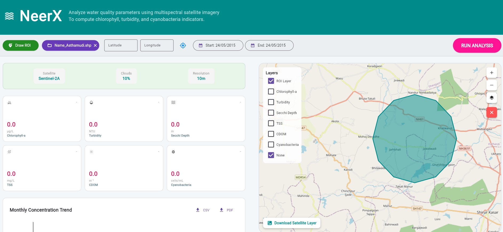
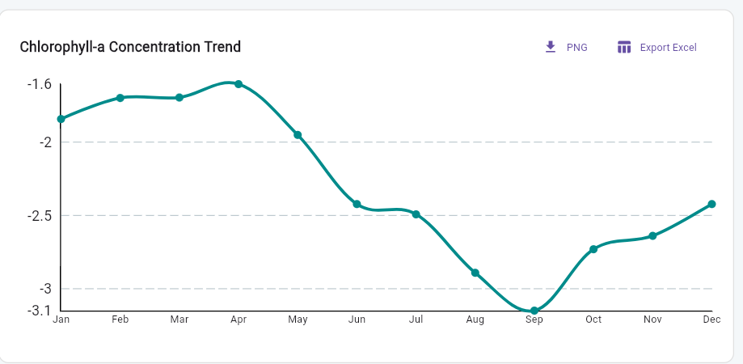
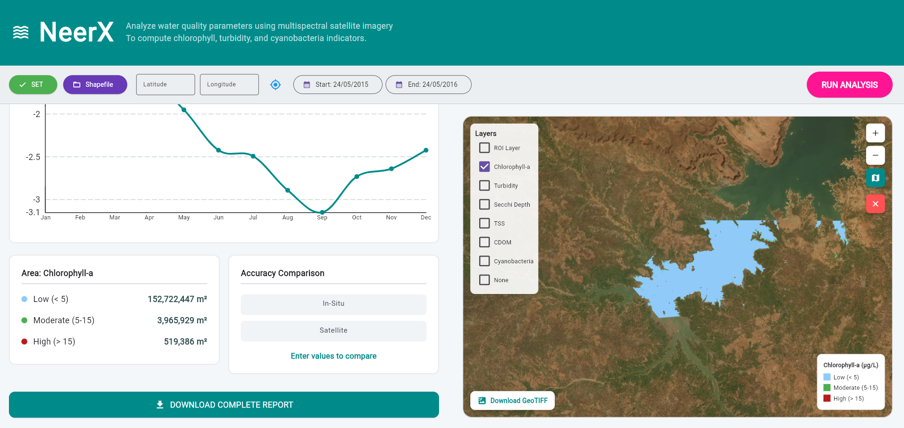

**📱Abstract**\
NeerX is a mobile application that analyzes water quality parameters using multispectral satellite imagery from Sentinel-2 satellites. The app provides real-time analysis of critical water quality indicators including Chlorophyll-a, Turbidity, Secchi Depth, TSS, CDOM, and Cyanobacteria levels.
By leveraging Google Earth Engine's computational capabilities, NeerX processes satellite data to generate water quality maps, concentration trends, and area distribution reports - all accessible through an intuitive mobile interface.

**Problem Statement**\
Traditional water quality monitoring requires physical sample collection and laboratory testing, which is time-consuming, expensive, and limited to specific locations. NeerX solves this by leveraging free satellite data to provide instant, wide-area water quality assessment.

**Solution**\
Using Google Earth Engine's computational capabilities, NeerX processes Sentinel-2 satellite imagery to generate:
Water quality parameter maps
Concentration trends over time
Area distribution reports
Accuracy comparison with in-situ data

### Dashboard View

### Monthly Chart

### Area Calculation

**✨ Features**

🗺️ Interactive Map - Draw ROI (Region of Interest) on satellite imagery
📊 Water Quality Parameters - Analyze 6 key parameters:
Chlorophyll-a (µg/L)
Turbidity (NTU)
Secchi Depth (m)
TSS (mg/L)
CDOM (m⁻¹)
Cyanobacteria (cells/mL)
📈 Monthly Trend Charts - Visualize concentration patterns over 12 months
📍 Shapefile Support - Upload custom ROI shapefiles
📥 Export Capabilities - Download GeoTIFF layers and Excel reports
🎨 Color-Coded Legends - Easy-to-understand visual indicators (Good/Moderate/Risk)

**🚀 Steps to Run**

1. Draw Region of Interest (ROI)
Click "Draw ROI" button
Tap on map to create polygon vertices
Click "SET" to finalize

2. Upload Shapefile (Alternative)
Click "Shapefile" button
Select .shp, .dbf, .shx, .prj files
ROI automatically loads from shapefile

3. Select Water Quality Parameter
Check any parameter from the grid
Options: Chlorophyll-a, Turbidity, Secchi Depth, TSS, CDOM, Cyanobacteria

4. Run Analysis
Click "RUN ANALYSIS" button
Wait 5-10 seconds for processing
View results on map and charts

5. Export Results
Button	Output
PNG	Chart as image
Export Excel	CSV data file
Download GeoTIFF	Satellite layer
DOWNLOAD COMPLETE REPORT	HTML report

